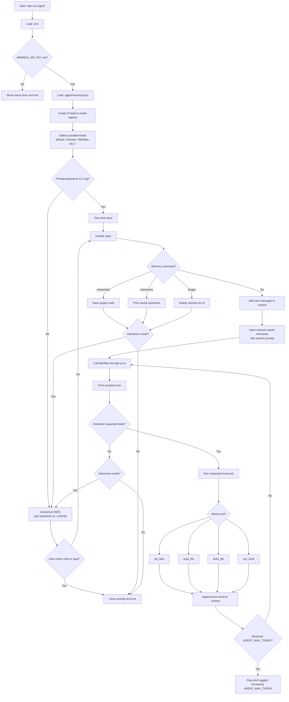

# Agent Flow

The CLI keeps conversation history in `context.messages`, loads explicit saved
memory from `.agent/memory.json`, sends the current context to MiniMax through
`pi-ai`, executes any requested local tools, feeds those results back into the
context, and repeats until MiniMax returns a final text response.
